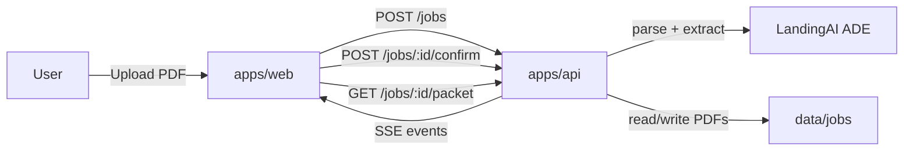

# Architecture

## Overview

This project is a local two-app monorepo:

- `apps/web`: Vite + React single-page interface
- `apps/api`: FastAPI backend for upload, extraction, review state, fill, and packet download

The product flow is simple:

1. Upload a title PDF
2. Extract title-derived fields with LandingAI
3. Score the extracted values
4. Pause for review
5. Fill the three HCD forms
6. Bundle the packet as a zip

## Runtime shape




Default local ports:

- web: `5173`
- api: `8000`

There is no database, auth layer, or external object storage in the current version.

## Main folders

```text
apps/
├── web/
│   ├── src/components/
│   ├── src/hooks/
│   ├── src/lib/
│   └── src/styles/
└── api/
    ├── src/pipeline/
    ├── src/routes/
    ├── src/schema/
    └── assets/forms/
```

## Pipeline stages


| Stage   | Purpose                                                  | Visible to user       |
| ------- | -------------------------------------------------------- | --------------------- |
| Ingest  | Save the upload and prepare job paths                    | Yes                   |
| Extract | Run LandingAI parse + schema extraction                  | Yes                   |
| Verify  | Score extracted values with ADE confidence + local rules | Yes, via terminal log |
| Review  | User corrects or completes form data                     | Yes                   |
| Fill    | Populate `476.6G`, `476.6`, `480.5`                      | Yes                   |
| Packet  | Zip the three output PDFs                                | Yes                   |


## Current extraction model

Extraction is LandingAI-only.

- `apps/api/src/pipeline/extract.py` calls `/v1/ade/parse`
- the returned markdown is passed into `/v1/ade/extract`
- a LandingAI-compatible schema is built from `ExtractSchema`
- if extraction fails, the job fails visibly

There is no heuristic parser fallback anymore.

## Current review model

The review screen is organized by form, one form at a time:

1. `476.6G`
2. `480.5`
3. `476.6`

Fields use the same wording as the PDF and the input type matches the field:

- text for freeform text
- date for dates
- number for numeric values
- yes/no selectors for yes/no questions

Some values are derived automatically:

- `480.5` Owner 1 can prefill from extracted registered owner
- `480.5` total price is calculated as base unit + unattached accessories
- fixed defaults like Section 5 `No` values stay deterministic

## SSE events

The UI is driven by server-sent events from `GET /jobs/{id}/events`.

Important events:

- `ingest.complete`
- `extract.started`
- `extract.provider`
- `extract.field`
- `extract.complete`
- `extract.failed`
- `verify.started`
- `verify.field_scored`
- `verify.complete`
- `verify.failed`
- `awaiting_review`
- `fill.started`
- `fill.form_complete`
- `packet.ready`
- `fill.failed`
- `stage.error`

## REST endpoints


| Method | Path                           | Purpose                               |
| ------ | ------------------------------ | ------------------------------------- |
| `POST` | `/jobs`                        | Create a job from uploaded PDF        |
| `GET`  | `/jobs/{id}/events`            | Stream job events                     |
| `POST` | `/jobs/{id}/confirm`           | Submit reviewed values and start fill |
| `GET`  | `/jobs/{id}/packet`            | Download the output zip               |
| `GET`  | `/jobs/{id}/thumbs/{form}.png` | Fetch generated thumbnails            |
| `GET`  | `/health`                      | Basic health check                    |


## State and files

Job state is stored in-memory in `apps/api/src/pipeline/state.py`.

Generated files live under:

```text
apps/api/data/jobs/{job_id}/
├── title.pdf
├── title.png
├── filled/
├── thumbs/
└── packet.zip
```

This is intentionally simple and optimized for local development and demo use.